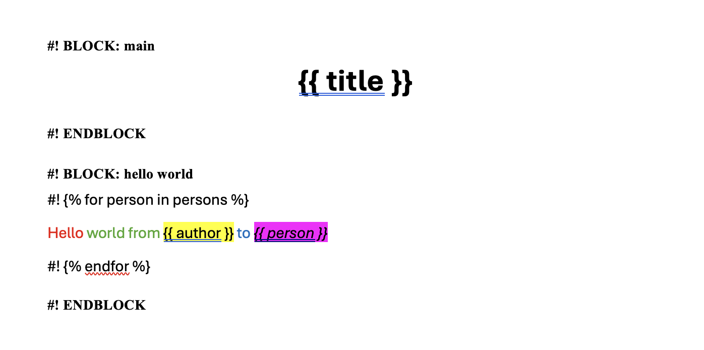
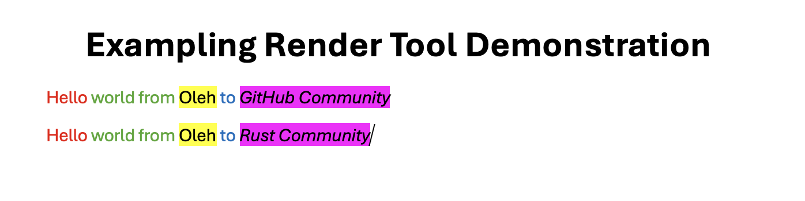

# DocxInfer
DocxInfer - a cli tool written in Rust, that allows you to convert .docx file filled with Jinja2 markup into json file describing variables set in the markup. Mainly designed to allow LLM's to fill strictly styled documents.

## Key features
- Automatic restoration of broken Jinja2 tags in XML.
- Generation of schemas in json format based on AST parsing.
- Loop support

## How it works
- Get document.xml file from your docx
- Parse it for blocks
- Move jinja markup outside xml tags, along with restoring their structure if Word has split them.
- Save blocks xml templates into template dir.
- Using minijinja ast parse this xmls and create block schema
- Using llm response schema and original docx render all blocks and return new .docx file

## How to use it
- Get it on your computer
- Create your template docx

- run 
```sh
docx-infer create --docx <your_docx_file_path>
```
- find templates and schemas in ./templates dir
```
templates
 ┣ hello world.json
 ┣ hello world.xml
 ┣ main.json
 ┗ main.xml
```
- Provide llm with schemas and necessary context
Example `hello world.json`
```json
{
  "Object": {
    "author": "Var",
    "persons": {
      "Array": "Var"
    }
  }
}
```
(Var shall be interpreted as any string)
- receive render schema from LLM in format
``` json
[
  {
    "block_name": "main",
    "block_data": {
      "title": "Exampling Render Tool Demonstration"
    }
  },
  {
    "block_name": "hello world",
    "block_data": {
      "author": "Oleh",
      "persons": [
        "GitHub Community",
        "Rust Community"
      ]
    }
  }
]
```
- render it running
```sh
docx-infer render --templates ./templates --docx ./example_template.docx --schema ./llm_output.json
```
- view result in rendere_<your_docx_file_name>.docx
